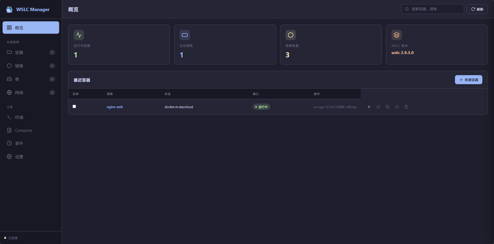

# WSLC Manager

Docker Desktop 风格的 WSLC (Windows Subsystem for Linux Containers) 管理工具。

## 功能特性

- **容器管理** - 创建、启动、停止、重启、删除、克隆、重命名容器
- **镜像管理** - 拉取、删除镜像，支持国内镜像源
- **卷管理** - 创建、删除数据卷
- **网络管理** - 创建、删除网络
- **批量操作** - 批量启动、停止、删除容器
- **实时监控** - CPU、内存使用率图表
- **Docker Compose** - 导入/导出 Compose 文件
- **终端** - 在容器中执行命令
- **日志** - 查看容器日志
- **主题** - 深色/浅色主题切换

## 截图



## 安装

### 从源码编译

```bash
# 克隆仓库
git clone https://github.com/yyefree/wslc-manager.git
cd wslc-manager

# 编译
cargo build --release

# 运行
./target/release/wslc-manager.exe
```

### 前置要求

- Rust 1.70+
- WSLC 2.9.3.0+

## 使用

启动后访问 `http://localhost:3000`

### 功能说明

| 功能 | 说明 |
|------|------|
| 概览 | 查看系统状态、容器列表 |
| 容器 | 管理所有容器，支持批量操作 |
| 镜像 | 管理镜像，支持拉取和删除 |
| 卷 | 管理数据卷 |
| 网络 | 管理网络 |
| 终端 | 在容器中执行命令 |
| Compose | 导入/导出 Docker Compose 文件 |
| 事件 | 查看操作日志 |
| 设置 | 主题切换、版本信息 |

## 技术栈

- **后端**: Rust + Axum + Tokio
- **前端**: 原生 HTML/CSS/JavaScript
- **实时通信**: WebSocket

## API 端点

| 方法 | 路径 | 说明 |
|------|------|------|
| GET | `/api/system` | 系统信息 |
| GET | `/api/containers` | 容器列表 |
| POST | `/api/containers/run` | 创建容器 |
| POST | `/api/containers/{name}/stop` | 停止容器 |
| POST | `/api/containers/{name}/start` | 启动容器 |
| POST | `/api/containers/{name}/restart` | 重启容器 |
| DELETE | `/api/containers/{name}/remove` | 删除容器 |
| POST | `/api/containers/batch/stop` | 批量停止 |
| POST | `/api/containers/batch/start` | 批量启动 |
| POST | `/api/containers/batch/remove` | 批量删除 |
| GET | `/api/images` | 镜像列表 |
| POST | `/api/images/pull` | 拉取镜像 |
| GET | `/api/volumes` | 卷列表 |
| POST | `/api/volumes/create` | 创建卷 |
| GET | `/api/networks` | 网络列表 |
| POST | `/api/networks/create` | 创建网络 |

## 开发

```bash
# 开发模式
cargo run

# 构建发布版本
cargo build --release
```

## 赞助

如果这个项目对你有帮助，欢迎请作者喝杯咖啡 ☕


## 许可证

MIT License

## 致谢

- [Axum](https://github.com/tokio-rs/axum) - Web 框架
- [Tokio](https://github.com/tokio-rs/tokio) - 异步运行时
- [WSLC](https://github.com/microsoft/WSL) - Windows Subsystem for Linux
